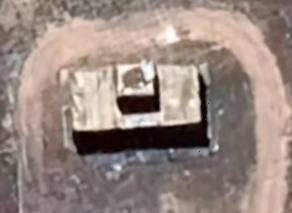
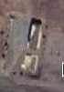
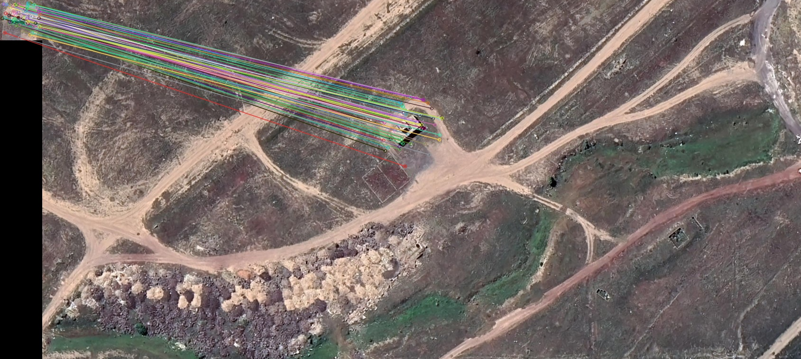
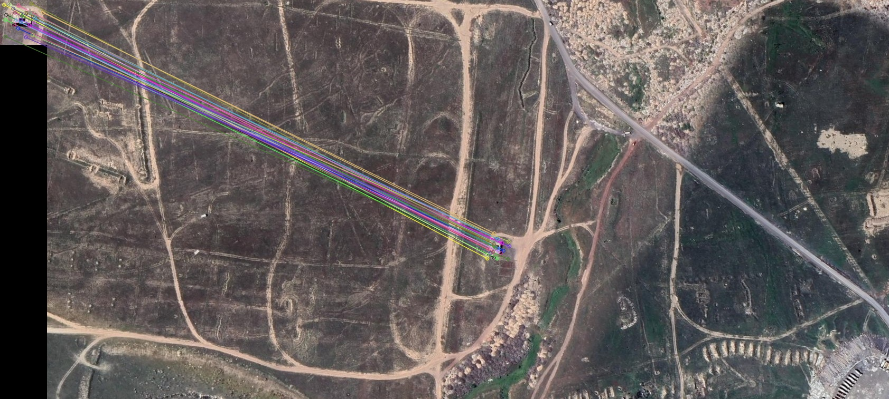
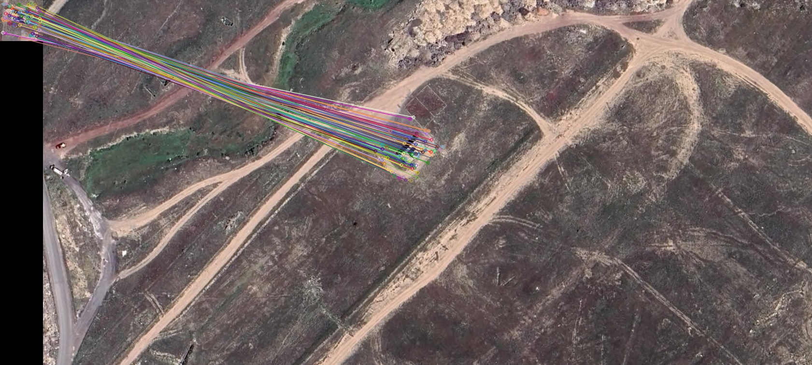
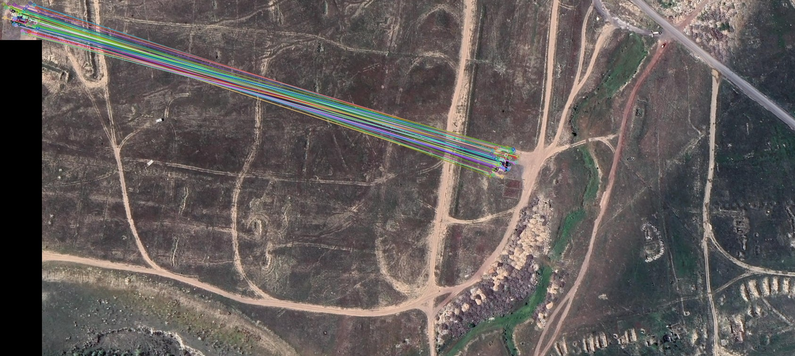
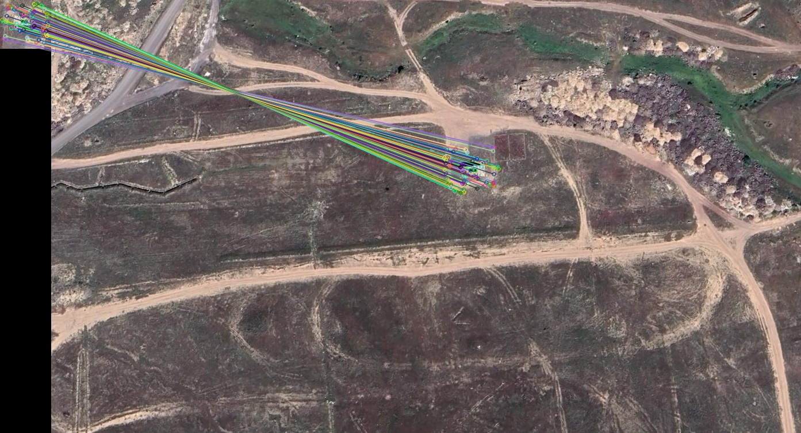
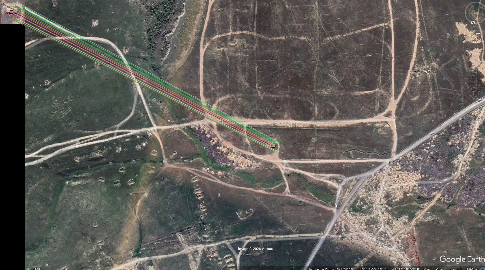

# Hybrid Zero-Shot Object Detection, Keypoint Verification & Tracking

> A high-accuracy computer vision pipeline combining GPU-accelerated zero-shot detection (Grounding DINO), invariant feature verification (SIFT + FLANN), and high-speed state tracking (CSRT) — designed for ultra-low false-positive environments such as satellite imagery analysis, UAV surveillance, and tactical target tracking.

---

# 📌 The Problem

| # | Bottleneck | Why It Fails |
|---|---|---|
| 1 | Heavy Neural Inference | Running Grounding DINO on every frame becomes prohibitively slow at high resolutions |
| 2 | Rotation & Scale Variance | Drone/satellite targets continuously rotate and change scale |
| 3 | Illumination Instability | Shadows, glare, weather, and day/night cycles break pixel-level matching |
| 4 | Tracker Drift | Lightweight trackers lose semantic awareness and cannot recover once drift occurs |

---

# 💡 Hybrid Solution

```text
┌─────────────────────────────────────────────────────────────────┐
│  LAYER 1 — GPU: Grounding DINO                                 │
│  Zero-shot semantic object proposals via text prompts          │
└────────────────────────┬────────────────────────────────────────┘
                         │ candidate boxes
┌────────────────────────▼────────────────────────────────────────┐
│  LAYER 2 — GPU: SIFT + FLANN Verification                      │
│  Cross-verification against target reference image             │
│  Rotation + scale invariant geometric matching                 │
└────────────────────────┬────────────────────────────────────────┘
                         │ verified lock
┌────────────────────────▼────────────────────────────────────────┐
│  LAYER 3 — CPU: OpenCV CSRT Tracker                            │
│  Lightweight real-time frame tracking                          │
│  Auto wake-up of DINO + SIFT on drift detection                │
└─────────────────────────────────────────────────────────────────┘
```

---

# ⚡ Key Advantages

- **⚡ High Performance** — Neural inference runs only when necessary
- **📐 Rotation & Scale Invariance** — SIFT descriptors remain stable under geometric transforms
- **🌦️ Illumination Robustness** — Semantic detection avoids brittle pixel-template matching
- **🔄 Self-Recovery** — Automatic re-localization when tracker confidence decays
- **🛰️ High-Resolution Scalability** — Efficient for large satellite/drone imagery

---

# 📊 Results & Demonstrations

## 🎥 Real-Time Video Tracking & Target Lock-On

<table align="center">
<tr>
<td align="center">

### Reference Target



</td>

<td align="center">

### Tracking Demo


</td>
</tr>
</table>

<p align="center">
Grounding DINO semantic proposals → SIFT verification → CSRT persistent tracking
</p>


---

## 📐 Batch Image Verification (Rotation & Scale Invariance)

<table align="center">
<tr>
<td align="center">

### Reference Target



</td>

<td align="center">

### Verification Demo


</td>
</tr>
</table>

<p align="center">
Scale & rotation invariant SIFT correspondence verification using FLANN matching
</p>
---
---

# 🖼️ Additional Matching Visualizations

<p align="center">
  
  
  
</p>

<p align="center">
  
  
  
</p>

<p align="center">
SIFT + FLANN geometric correspondence visualizations across varying scales, rotations, and illumination conditions
</p>
# 🛠️ Repository Structure

```text
object-tracking-sift-dino/
├── data/
│   ├── inputs/
│   │   ├── target.jpg
│   │   ├── video.mp4
│   │   └── images/
│   └── outputs/
│       ├── output_detected_video.mp4
│       ├── output_accurate/
│       └── matching_visuals_0.75/
│
├── src/
│   ├── video_pipeline.py
│   └── image_pipeline.py
│
├── requirements.txt
└── README.md
```

---

# ⚙️ Technical Parameters

| Parameter | Value | Purpose |
|---|---|---|
| SIFT Lowe's Ratio | `0.75` | Removes ambiguous feature correspondences |
| Minimum SIFT Matches | `≥ 7` | Suppresses geometric false positives |
| Tracker | `CSRT` | Highest OpenCV lightweight tracking accuracy |
| Detection Backend | `Grounding DINO` | Open-vocabulary semantic object detection |
| Acceleration | `PyTorch CUDA` | GPU-accelerated inference |

---

# 🚀 Setup

## Install Dependencies

```bash
pip install -r requirements.txt
```

---

## Real-Time Video Tracking

```bash
python src/video_pipeline.py \
  --target data/inputs/target.jpg \
  --video data/inputs/video.mp4
```

---

## Batch Image Verification

```bash
python src/image_pipeline.py \
  --target data/inputs/target.jpg \
  --images data/inputs/images/
```

---

# 📐 Mathematical Foundation

## SIFT Scale-Space Extrema Detection

$$
L(x, y, \sigma) = G(x, y, \sigma) * I(x, y)
$$

SIFT detects keypoints in Difference-of-Gaussians scale space, providing inherent scale invariance.

---

## Lowe’s Ratio Test

$$
\frac{d_1}{d_2} < 0.75
$$

A match is accepted only when the nearest descriptor is significantly closer than the second-nearest descriptor.

This eliminates weak or ambiguous correspondences.

---

## FLANN Complexity Reduction

FLANN reduces nearest-neighbor search complexity from:

$$
O(n^2)
$$

to approximately:

$$
O(n \log n)
$$

making real-time matching feasible for large descriptor sets.

---

# 🔄 Drift Recovery Mechanism

```text
CSRT Confidence Drop
          ↓
Re-trigger Grounding DINO
          ↓
Run SIFT + FLANN Verification
          ↓
Reinitialize Tracker
```

This creates a self-healing tracking architecture capable of long-duration persistence.

---

# 🛰️ Real-World Applications

- Satellite imagery intelligence
- UAV reconnaissance systems
- Tactical target tracking
- Maritime surveillance
- Persistent object monitoring
- Open-world search-and-track systems
- Autonomous aerial observation

---

# 📋 Requirements

Key dependencies:

- torch (CUDA)
- groundingdino
- opencv-python
- numpy

See:

```text
requirements.txt
```

---

# 🧠 Summary

This system combines:

- **Semantic understanding** via Grounding DINO
- **Geometric verification** via SIFT + FLANN
- **Temporal persistence** via CSRT tracking

instead of relying on a single fragile technique.

The result is a fast, rotation-invariant, illumination-robust, self-recovering object tracking pipeline optimized for real-world aerial and tactical environments where false positives are unacceptable.
